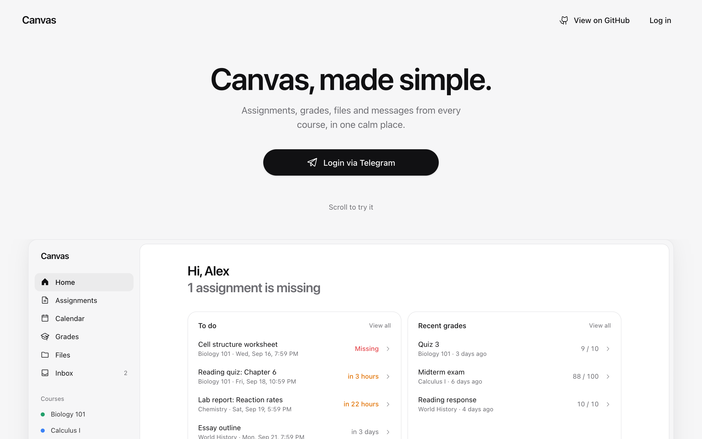
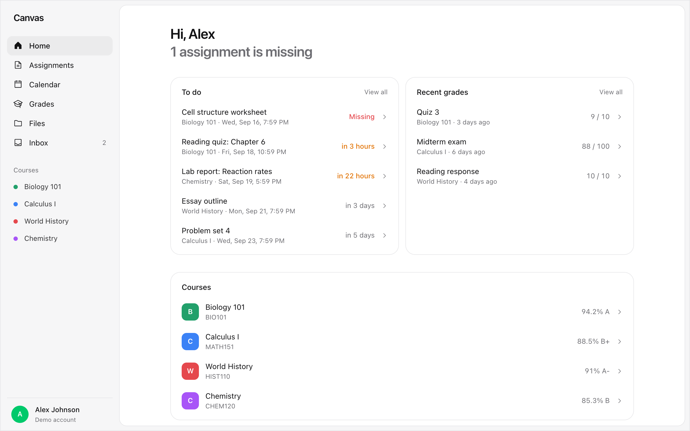
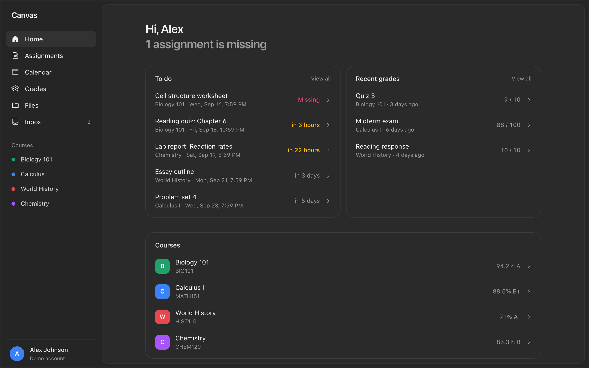
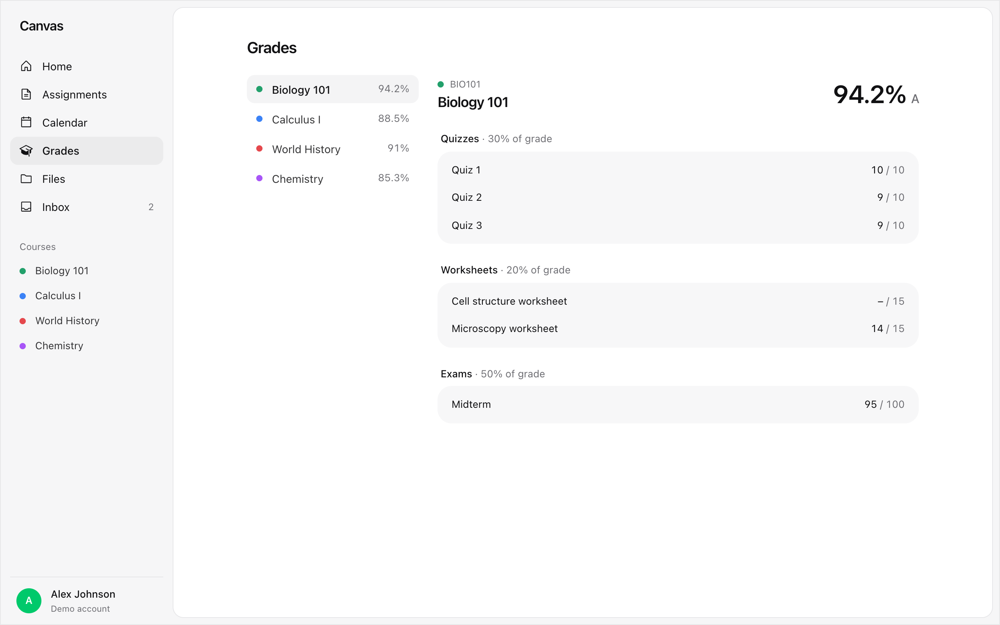
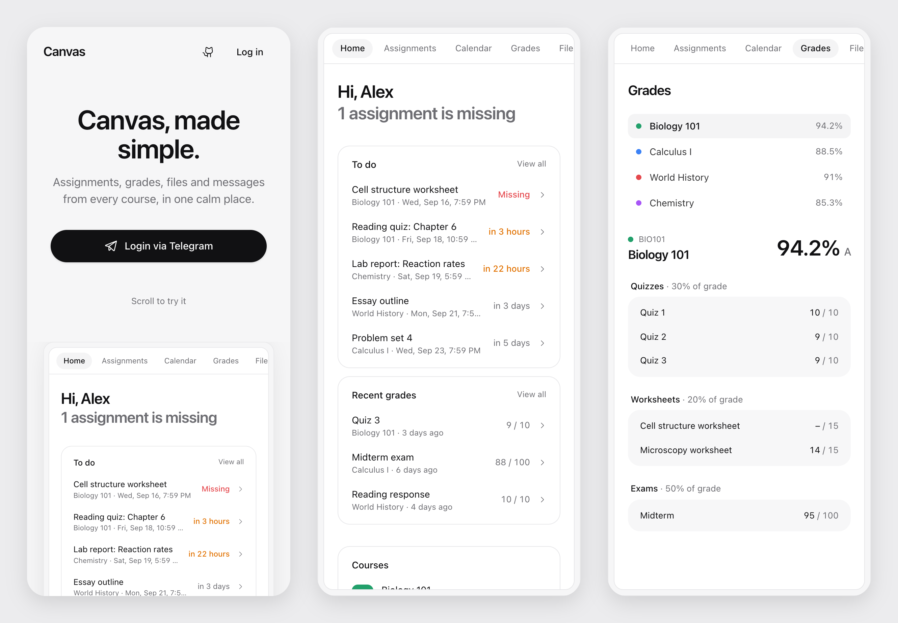
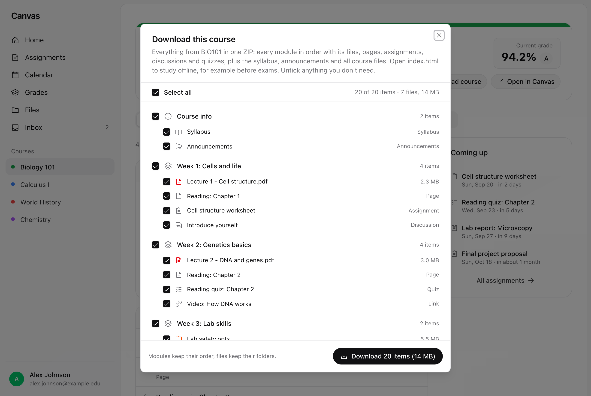

# Canvas Dashboard: a simple Canvas LMS dashboard for students

[](LICENSE)
[](https://nextjs.org)
[](https://www.typescriptlang.org)
[](https://t.me/canvas_sonungo_com_bot)

**Canvas Dashboard** is a free, open-source student dashboard for **Canvas LMS** by Instructure. It shows your assignments, due dates, grades, course files, announcements and Canvas Inbox messages from every course in one clean, fast place, on desktop and on your phone. You log in with Telegram, and nothing happens until you approve it there.



## Screenshots

These pictures use sample data, not a real student's account. You can try the same demo on the landing page without logging in.

| Home | Home, dark mode |
| --- | --- |
|  |  |

| Grades | On a phone |
| --- | --- |
|  |  |

**Download a whole course** as one ZIP: every module with its files, pages, assignments, discussions and quizzes, plus the syllabus and announcements. Tick what you need.



## Features

- **Home:** what's due, with missing and late work first, plus recent grades and your courses.
- **Assignments and due dates:** filter by upcoming, missing, submitted or past. Submit files, text or links.
- **Courses:** modules, pages, files, assignments, announcements and discussions for each course.
- **Download a whole course:** everything from a course in one ZIP to study before exams or offline. Every module in order with its files, pages, assignments, discussions, quizzes and links, plus the syllabus, announcements and all course files, and an `index.html` that links it all. Pick modules or single items, or select all.
- **Grades:** each course's breakdown by assignment group, with grading periods and a what-if grade calculator.
- **Files:** browse, search, preview and download course files and your personal Canvas files.
- **Inbox:** read, write and reply to Canvas messages.
- **Calendar, To-Do, Announcements and Discussions.** Personal to-dos are Canvas planner notes, so they sync with the Canvas app.
- **Light and dark mode.** It works on phones, tablets and desktops.
- **Fast.** The page you open loads first. The other pages load quietly in the background, so switching pages is instant.

## How login works

You log in through the Telegram bot [@canvas_sonungo_com_bot](https://t.me/canvas_sonungo_com_bot). The bot stores your Canvas token; this website never asks for it.

1. Send `/portal` to the bot. It replies with a one-time link that works for 30 seconds.
2. Open the link. The website shows "Approve on Telegram" and loads nothing yet.
3. The bot asks you to approve. The message shows the device, location, IP address and time of the login.
4. Choose one of three buttons:
   - **View only (recommended):** you can see everything, but nothing can be submitted, posted or changed.
   - **Full access:** you can also submit work, post and send messages.
   - **Deny:** nobody is logged in.
5. The website opens your dashboard.

**Your sessions:**

- Send `/sessions` to the bot to see where you are logged in. You can log out one session or all of them there, and the website notices on the next click.
- The website logs you out after 1 hour without activity, meaning no clicks, typing or scrolling.
- Logging out on the website also removes the session from `/sessions`.

## Security

- **Your Canvas token never reaches the browser.** The website's server keeps it in an encrypted, httpOnly cookie (AES-256-GCM) and makes every Canvas call itself.
- **View only is enforced by the server.** In a view-only session, every request that would change something is refused. Hiding the buttons is only a convenience.
- **Every login is approved in Telegram.** The one-time link works once and expires in 30 seconds. The Canvas token is handed over only after you approve, and only once.
- **Sessions can be ended from Telegram.** The server checks with the bot's backend, at most once a minute, that your session is still active.
- **Files are served safely.** Only images, PDFs, audio, video and plain text open in the browser, always with a fixed content type. Everything else downloads, so a file can't run code on this site.
- **Only what the site needs.** Canvas endpoints that would hand out a full Canvas login or API tokens are blocked, and changes must come from this site itself.

## Run it locally

You need Node.js 20.9 or newer.

```bash
git clone https://github.com/zkalykov/canvas-dashboard.git
cd canvas-dashboard
npm install
cp .env.example .env
```

Then choose how to log in while developing, and set it in `.env`:

- **Easiest: `DEV_MODE=1`.** Add your Canvas address and a personal access token as `CANVAS_BASE_URL` and `CANVAS_API_TOKEN`. Every page then uses that account without logging in. This only works with `npm run dev`.
- **Token login: `MANUAL_MODE=1`.** The landing page shows "Login via Canvas token", where you paste your Canvas address and a token.
- **Telegram login:** works out of the box against the public bot. Set `PORTAL_URL` if you run your own bot backend.

To create a Canvas token, open Canvas, then Account, Settings, Approved Integrations, New Access Token.

```bash
npm run dev     # http://localhost:3000
```

## Settings

All settings go in `.env`. `.env.example` explains each one.

| Setting | Needed | What it does |
| --- | --- | --- |
| `SESSION_SECRET` | In production | Encrypts the login cookie. Create one with `openssl rand -hex 32`. |
| `MANUAL_MODE` | No | `1` adds "Login via Canvas token" to the landing page. |
| `ALLOWED_CANVAS_HOSTS` | No | Comma-separated Canvas sites allowed for token login. Empty allows any public https Canvas site. |
| `PORTAL_URL` | No | The Telegram bot's backend. Default: `https://canvas.sonungo.com`. |
| `PORTAL_API_KEY` | Recommended | A shared secret with the bot's backend, so only this site can request logins. Set the same value on both; set it here first. |
| `LOCATION_LOOKUP` | No | `0` stops the IP location lookup on ipapi.co that fills the approval message. |
| `SITE_URL` | No | The site's public address for the sitemap and link previews. Vercel fills it in by itself. |
| `DEV_MODE` | No | `1` skips login during `npm run dev`. Needs `CANVAS_BASE_URL` and `CANVAS_API_TOKEN`. |

## Deploy

**Vercel:** import the repository, set `SESSION_SECRET` and any other settings in the project's environment variables, and deploy. No other setup is needed.

**Docker:** fill in `.env`, then run:

```bash
docker compose up --build   # http://localhost:3000
```

**Deploy the bot backend together with this site.** The website and the Telegram bot backend ([canvas.sonungo.com](https://github.com/zkalykov/canvas.sonungo.com)) talk to each other for login approval and sessions, so ship changes to both at the same time.

## How it's built

Next.js 16 with the App Router, React 19, TypeScript, Tailwind CSS 4, shadcn/ui, SWR and Phosphor icons, on the Canvas REST API.

```
src/
  app/                  pages, plus the API routes under app/api
    api/canvas/         proxy: adds your token server-side and forwards to Canvas
    api/auth/           Telegram link login, sessions, activity, logout
    api/files/          streams file bytes for preview and download, and whole-course ZIPs
    api/upload/         file uploads for submissions
  components/           one folder per feature (dashboard, grades, files, inbox, ...)
  hooks/use-canvas.ts   data hooks (SWR), one per kind of Canvas data
  lib/canvas-api.ts     the Canvas client used by the hooks
  lib/canvas-server.ts  server side: session cookie, credentials, portal checks
  proxy.ts              HTTPS redirect and the sliding 1-hour session
```

A page asks a hook for data. The hook calls the Canvas client, which calls `/api/canvas/...` on this site. The server adds your token and forwards the call to Canvas. `CLAUDE.md` has the details for contributors: the Canvas API quirks, loading order and auth.

| Command | What it does |
| --- | --- |
| `npm run dev` | Development server on port 3000 |
| `npm run build` | Production build, which also checks types |
| `npm start` | Runs the production build |
| `npm run lint` | ESLint |

## FAQ

**Is Canvas Dashboard free?**
Yes. It's free and open source under the MIT license.

**Does it work with my school's Canvas?**
It works with any Canvas LMS site that allows personal access tokens, which most schools on Instructure Canvas do.

**Is it an official Canvas or Instructure app?**
No. It's an independent student project that uses the public Canvas REST API.

**Can it submit assignments?**
Yes, with Full access: files, text or links. A View only session can't submit or change anything.

**Is my Canvas token safe?**
The token stays on the server in an encrypted cookie and never reaches the browser. Every login needs your approval in Telegram, and you can end any session from Telegram with `/sessions`.

**How do I report a bug or suggest a feature?**
Open an issue on [GitHub](https://github.com/zkalykov/canvas-dashboard/issues).

## License

MIT, see [LICENSE](LICENSE). Not affiliated with Instructure. Canvas is a trademark of Instructure, Inc.
